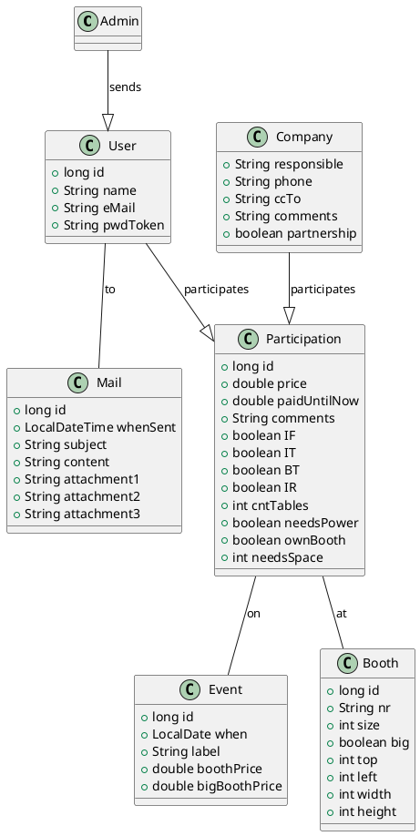

# Requirements

## The task

The task is to develop an admin panel for the 'business day' of our school.

## Model - Conceptional

The basis of the app is shown in the following model:

```plantuml
@startuml

class Admin {
}

class User {
    +long id
    +String name
    +String eMail
    +String pwdToken
}

class Mail {
    +long id
    +LocalDateTime whenSent
    +String subject
    +String content
    +String attachment1
    +String attachment2
    +String attachment3
}

class Participation {
    +long id
    +double price
    +double paidUntilNow
    +String comments
    +boolean IF
    +boolean IT
    +boolean BT
    +boolean IR
    +int cntTables
    +boolean needsPower
    +boolean ownBooth
    +int needsSpace
}

class Company {
    +String responsible
    +String phone
    +String ccTo
    +String comments
    +boolean partnership
}

class Event {
    +long id
    +LocalDate when
    +String label
    +double boothPrice
    +double bigBoothPrice
}

class Booth {
    +long id
    +String nr
    +int size
    +boolean big
    +int top
    +int left
    +int width
    +int height
}

Admin --|> User : sends
User -- Mail : to
User --|> Participation : participates
Company --|> Participation : participates
Participation -- Event : on
Participation -- Booth : at

@enduml
```
