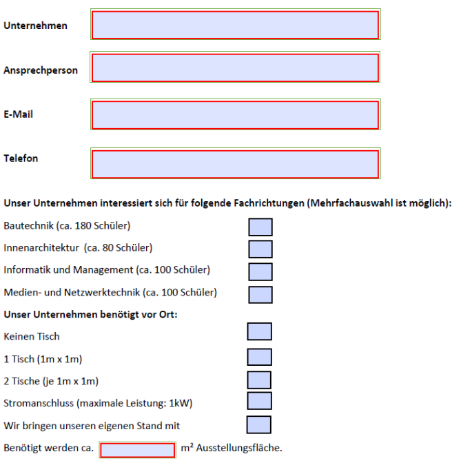

# Requirements

## The task

The task is to develop an admin panel for the 'business day' of our school.

## Model - Conceptional

The basis of the app is shown in the following model:

A teacher organizes a Business Day as an admin. First, they create an event on a specific date (when) with a name (label, e.g., Business Day 2025) and set prices for regular booths (boothPrice) and larger booths (bigBoothPrice, which are twice the size). Then, they send an invitation via email (whenSent, subject) to companies. The email includes content and may have optional links or attachments.

A contact person (responsible) registers a company for the event through a form in the link or attachment. They also specify the company’s interests and the equipment needed for their booth (IF/../IR, needsSpace, etc. – see registration form below).

For the next Business Day/event, the admin can select some or all companies before sending the invitation email. They can assign these companies to their previous or an updated booth with the required equipment. The admin can add or update companies at any time. This includes setting an optional ccTo email address. If provided, the specified email address (EDK, ORG, KAA, etc.) will receive a copy of all emails sent by the admin. Ideally, this also includes all replies from companies via "reply all" so that the contact person stays informed.

The admin sets the prices for regular and large booths (boothPrice and bigBoothPrice) for each Business Day. When creating participation entries, registered companies receive their respective price (price), depending on whether they have a regular or large booth (big). Business partners of the HTL (partner) can participate in Business Days for free.

Implement the corresponding controllers based on spring boot. Implement JUnit test for all the CRUD operations following the UseCases provided below.

## Use Cases

Every use case describes a scenario for an actor and what leads to success or failure.

| ID  | Role     | User Story: wants to | Reason: so that they can |
|-----|---------|---------------------|--------------------------|
| 1   | Admin   | create a new Business Day (FT) | manage a new FT and add an event |
| 2   | Admin   | add existing companies | invite companies from previous FTs   1. Admin selects companies   2. For each company:   - add participation to FT   - add company’s last booth + equipment   - send email and add MailLog entry |
| 3   | Admin   | invite a new company (to FT, meaning to engage a new responsible person) | invite additional companies to an FT, send email and add MailLog, the company gets a booth with default equipment |
| 4   | Admin   | send emails to registered companies | inform all or individual companies |
| 5   | Responsible | register a new company | register their company for an FT |
| 6   | Admin   | view, edit, and delete registrations for an FT | review registrations for an FT, send emails as confirmations or reminders |
| 7   | Admin   | view emails | know who should receive emails and who has already received them |
| 8   | Admin   | settle an FT | check income with the account |
| 9   | Admin   | view open invoices | send invoices via email |
| 10  | Admin   | edit user data | add, change, and delete different types of users |
| 11  | Admin   | print the booth layout for an FT | create a plan of the booth layout |

** Add a new Company **

| ID | 1                                                                                                                                                                                                                                                                                                                                                                                                                                                                                                                                                                                                                                                                                                                                                                                                                |
|---|------------------------------------------------------------------------------------------------------------------------------------------------------------------------------------------------------------------------------------------------------------------------------------------------------------------------------------------------------------------------------------------------------------------------------------------------------------------------------------------------------------------------------------------------------------------------------------------------------------------------------------------------------------------------------------------------------------------------------------------------------------------------------------------------------------------|
| Name | Create a new company day (FT)                                                                                                                                                                                                                                                                                                                                                                                                                                                                                                                                                                                                                                                                                                                                                                                    |
| Short Description | An administrator creates a new company day in the mobile client                                                                                                                                                                                                                                                                                                                                                                                                                                                                                                                                                                                                                                                                                                                                                  |
| Actors | Administrator                                                                                                                                                                                                                                                                                                                                                                                                                                                                                                                                                                                                                                                                                                                                                                                                    |
| Pre-Conditions | There is no company day (event) with this label in the database, and the administrator fills out all fields                                                                                                                                                                                                                                                                                                                                                                                                                                                                                                                                                                                                                                                                                                      |
| Post-Conditions | The data was saved in the database via the API, and the date is in the future                                                                                                                                                                                                                                                                                                                                                                                                                                                                                                                                                                                                                                                                                                                                    |
| Trigger | An administrator presses the Save button in the mobile client application or closes the corresponding GUI                                                                                                                                                                                                                                                                                                                                                                                                                                                                                                                                                                                                                                                                                                        |
| Basic / Normal Flow | An administrator logs in via the mobile client, enters all data for a new company day, and saves the data in the database via the API                                                                                                                                                                                                                                                                                                                                                                                                                                                                                                                                                                                                                                                                            |
| Alternative Flows | There is already a company day with this label, or the API is unavailable, or data for the company day is missing, or the event date is in the past                                                                                                                                                                                                                                                                                                                                                                                                                                                                                                                                                                                                                                                              |
| Test Cases | Test case – TC 1 Precondition: An administrator has not yet entered a company day with the same label Action: An administrator wants to create a company day but forgets to specify a future date Result: Error message: The date must be in the future.   Test case – TC 2 Precondition: An administrator has not yet recorded a company day with this label Action: An administrator wants to create a company day but assigns a label that already exists Result: Message: This company day already exists   Test case – TC 3 Precondition: An administrator has not yet created a company day with the same label Action: An administrator wants to create a company day but forgets to enter all data Result: Error message: Data is missing to create this company day, e.g., the price is missing |
|---| ---                                                                                                                                                                                                                                                                                                                                                                                                                                                                                                                                                                                                                                                                                                                                                                                                              |